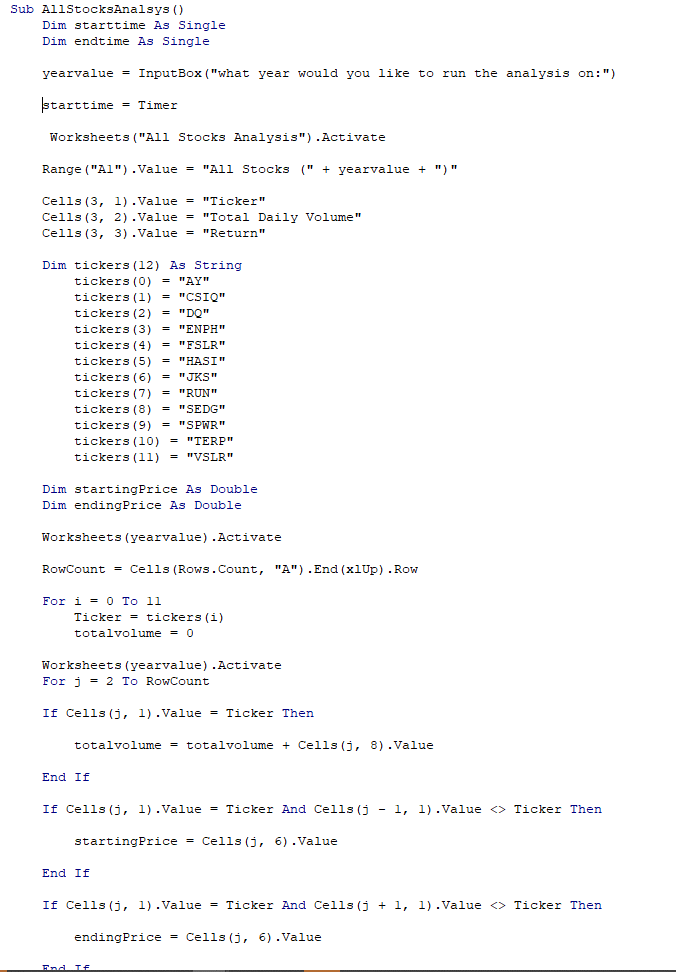
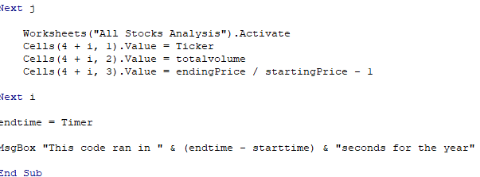
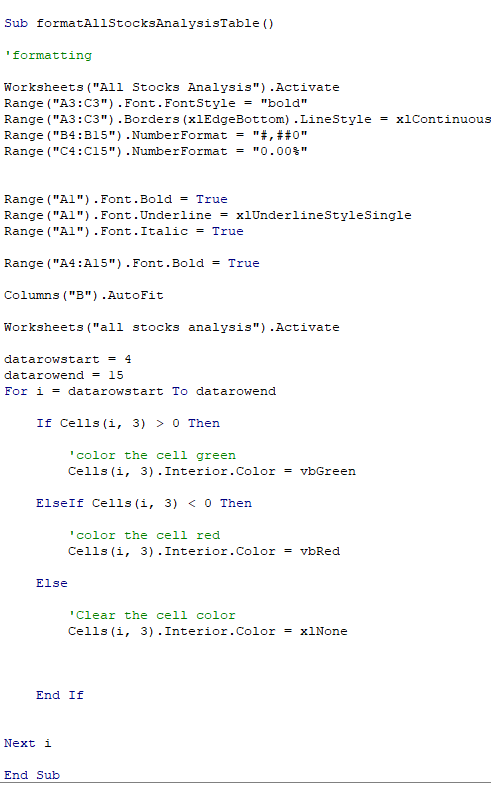
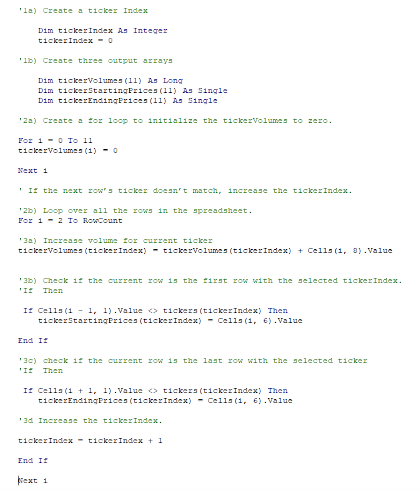
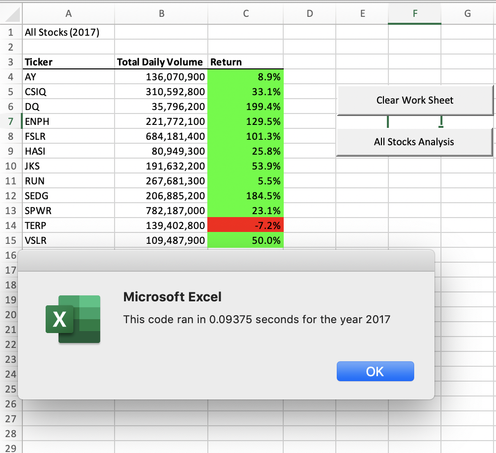
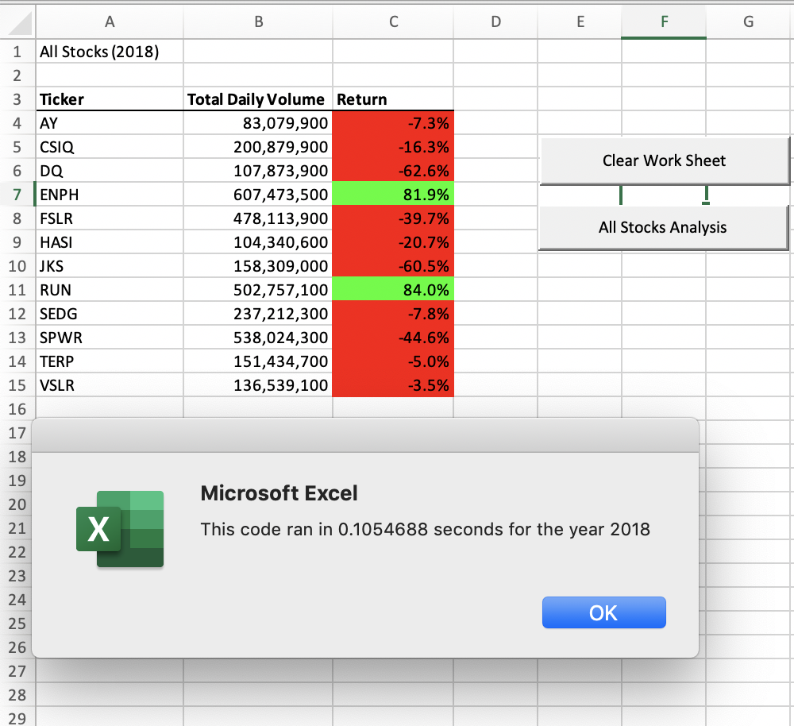

## The Vba Of Wall Street

## Summary
* A homework assignment for UC Berkeley's Data Analytics Bootcamp.
* Files present an exploratory analysis of VBA on excel.

### Files

* The Vba_Challengue.xlsm file is an Excel File with an format to includes Macros, but make sure to everytime you open it to enable the macro option that will pop out automatic every time you open the file.

## Stock Market Analysis

* Create a script that will loop through each year of stock data and grab the total amount of volume each stock had over the year.	 
	 
	  
	.
	 

* Create a script that will loop through all the stocks and take the following info
Yearly change from what the stock opened the year at to what the closing price was
The percent change from the what it opened the year at to what it closed
The total Volume of the stock
Ticker symbol.
 
  
  . 
  
  
  * Create a script that will loop through each year of stock data and grab the total amount of volume each stock had over the year.

  . 
  
  * After all the scripts, we have to make another one to  conditional formatting the cells will highlight positive change in green and negative change in red.

.
  
  
  

  
  
## Report

1. Create a Refactored Code
2. VBA_Challengue 2017
3. VBA_Challengue 2018

**Creating a Refactored Code?.**
   
  *  Code Refactoring is the process of clarifying and simplifying the design of existing code, without changing its behavior. Agile teams are maintaining and extending their code a lot from iteration to iteration, and without continuous refactoring, this is hard to do. Example

  . 

  
   

**VBA Challengue 2017/2018.**

* Make the appropriate adjustments to your script that will allow it to run on every worksheet just by running it once.

* After having made all the scripts shown above, we reach the final point where we have interaction between all the sheets using VBA to obtain a final result, organized, structured and ready to read. 

. 

. 

  
